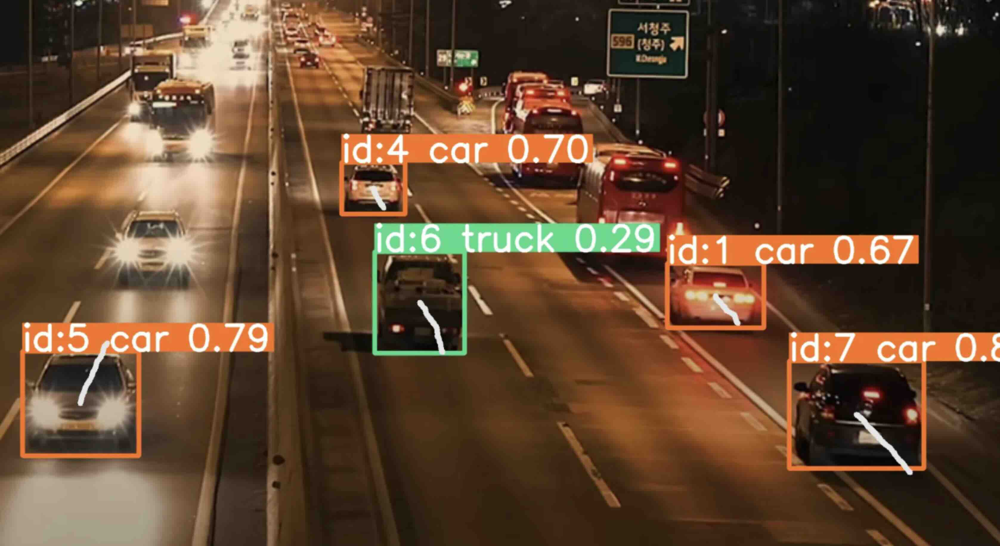

# YOLO Traffic Tracking Project


## Introduction
This project utilizes the YOLO (You Only Look Once) v8 model for real-time traffic tracking, particularly focusing on vehicle detection in video streams. By leveraging the power of YOLO's deep learning capabilities, this project aims to provide insights into traffic flow, vehicle count, and other relevant metrics that can aid in traffic management and analysis.

## Project Setup

### Prerequisites
Before you begin, ensure you have the following installed:
- Python 3.8 or above
- pip (Python package installer)
- Virtualenv (optional, for creating isolated Python environments)

### Installation
1. Clone this repository to your local machine:
   ```bash
   git clone https://github.com/yourusername/yolo_traffic_tracking.git
   ```
2. Navigate to the project directory:
   ```bash
   cd yolo_traffic_tracking
   ```
3. (Optional) Create and activate a virtual environment:
   ```bash
   virtualenv venv
   source venv/bin/activate  # On Windows use `.\venv\Scripts\activate`
   ```
4. Install the required Python packages:
   ```bash
   pip install -r requirements.txt
   ```

## Usage

To run the traffic tracking script, navigate to the project directory and execute:

```bash
python yolo_tracking.py <path_to_your_video>
```

Replace `<path_to_your_video>` with the actual path to the video file you wish to analyze.

## Features

- Real-time vehicle detection and tracking
- Output video with tracking annotations
- Customizable for different video sources

## Contributing

Contributions to this project are welcome! Please fork the repository, make your changes, and submit a pull request.

## Acknowledgements

- Thanks to the Ultralytics team for providing the YOLOv8 model.
- This project was inspired by the need for advanced traffic management solutions in urban areas.

## Contact

For any queries or further information, please contact me at [https://www.linkedin.com/in/maxime-jabarian/].
